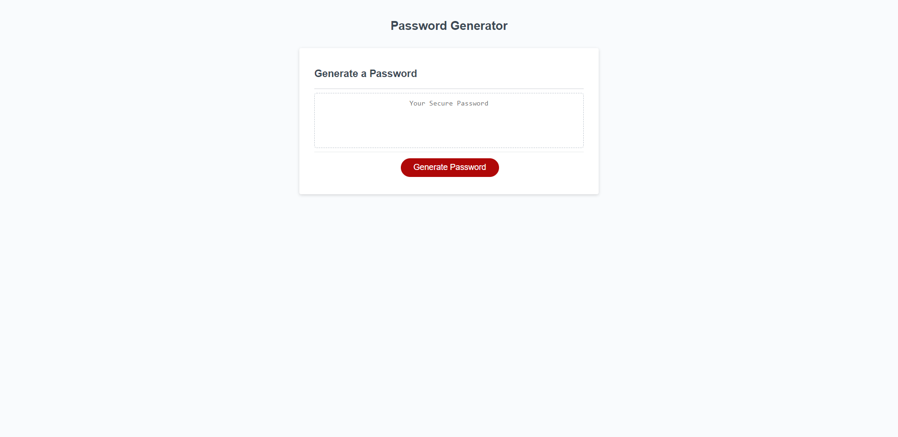
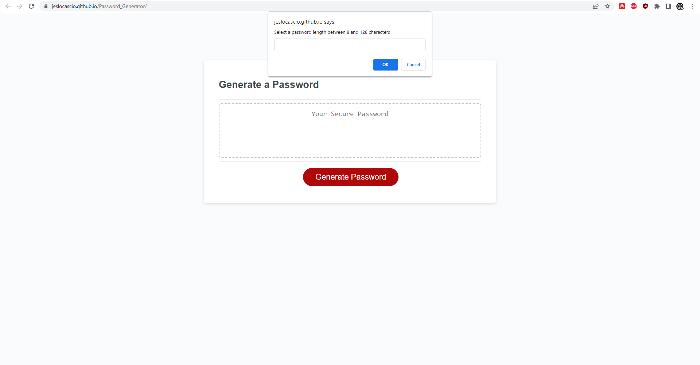
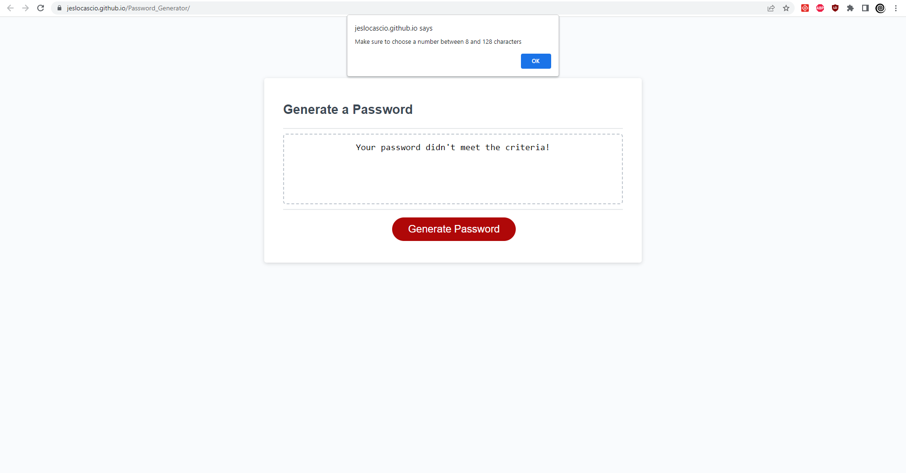
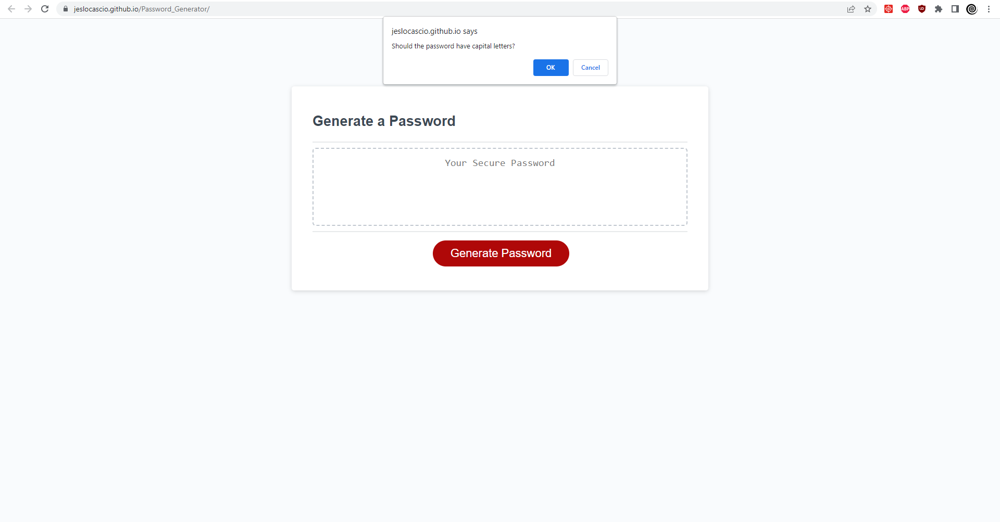
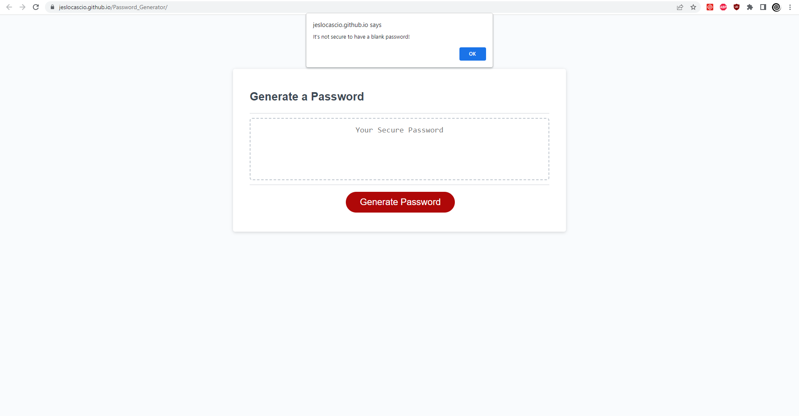
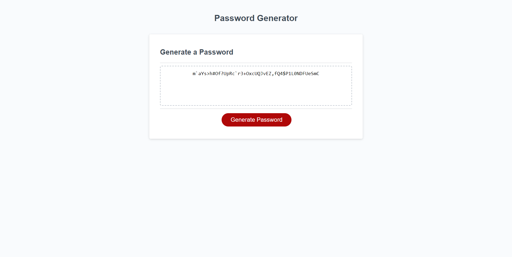

# Password_Generator

## Description

When creating this project, I set out to provide a successful password generator to help people better secure any accounts they may have. By completing this assignment, I learned the functality of the concat() method.

## Installation

N/A

## Usage

You can access the website here: https://jeslocascio.github.io/Password_Generator/

To use this page, simply click the "Generate Password" button on the screen, as seen below:

 After you click the button, a prompt box will appear asking you to select a password length. This is demonstrated here:
 
 

 If you fail to set a password length in a way that matches the criteria, it displays these messages:

If you set a password length correctly, then you will be shown a series of confirmation boxes. These will ask you what character sets you would like to include by either hitting "Ok" or "Cancel". Here is an example of these confirmation boxes: 

If you deny all character sets by canceling the confirmation boxes, you will get this alert message, prompting you to try again:

Once you have set a correct password length, and confirmed at least character set, the website will generate a password in the text box. Here is an example of such password:

After you receive your password, you may refresh the page and redo this process as many times as you like!

## Credits

Rutgers Fullstack Flex Coding Bootcamp provided the starter code.

## License

MIT License

Please refer to the LICENSE in the repo for more information.

## Features

Password Generator Button

Alert Boxes

Prompt Boxes

Confirmation Boxes

Text Box to store Generated Password